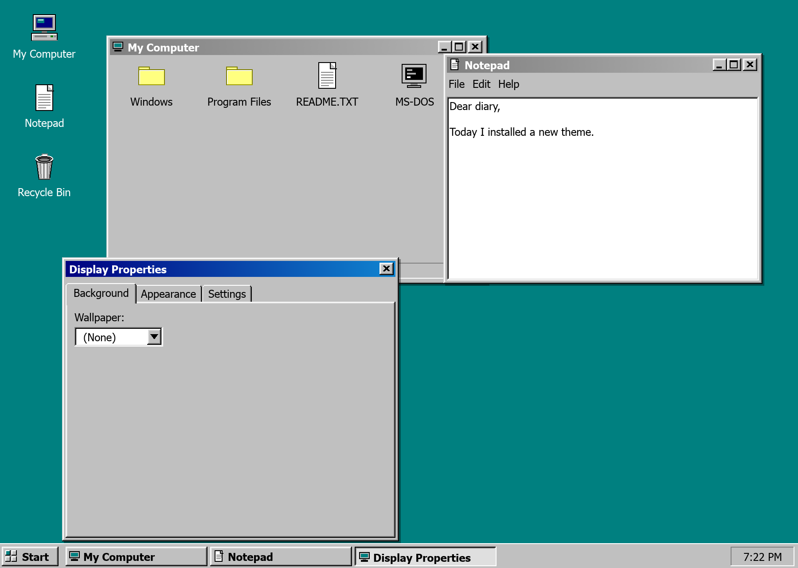
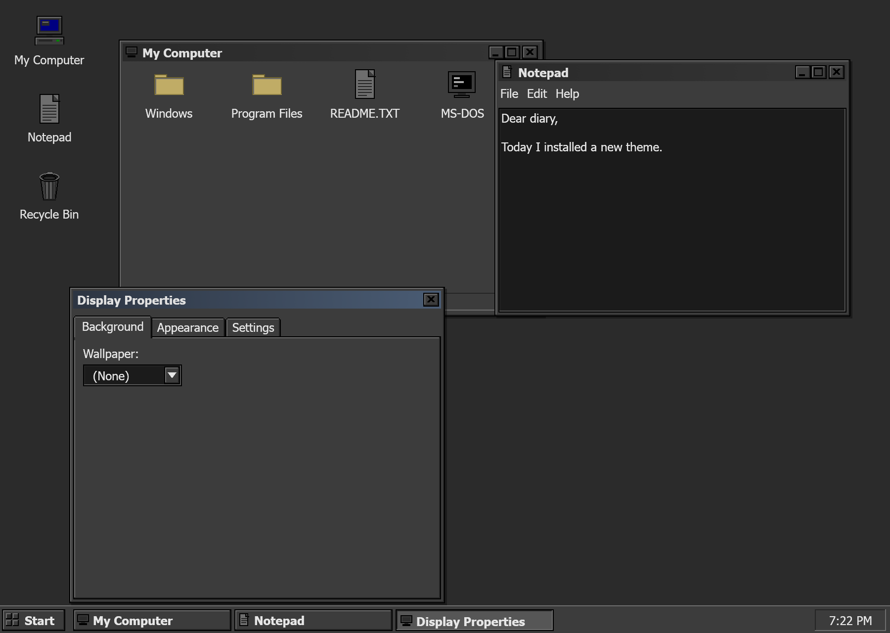
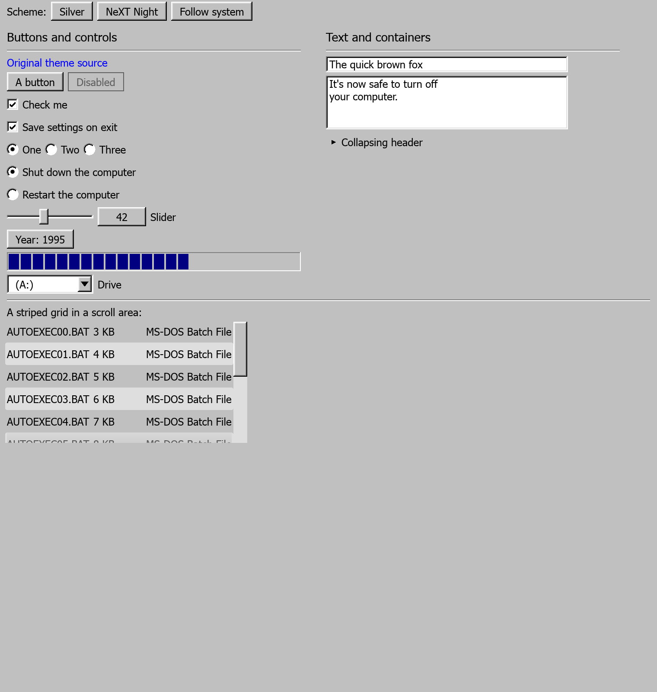
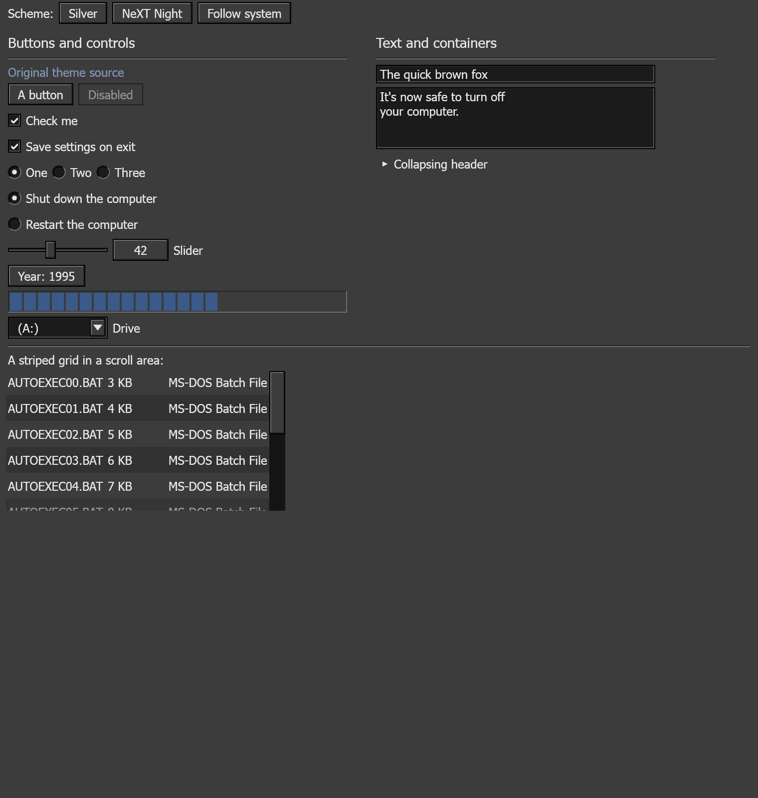

# egui-theme-boomer

Classic beveled desktop themes for [egui](https://github.com/emilk/egui):
**Silver** — the exact Windows 95 "Windows Standard" colors — as your light
theme, and **NeXT Night** — charcoal chrome, black keylines, steel accents —
as your dark theme.

The palettes, bevel conventions, metrics, and pixel icons are ported from
[BevelDesk](https://github.com/marchildmann/BevelDesk) (MIT), a Dear ImGui
desktop environment simulator.

| Silver | NeXT Night |
|---|---|
|  |  |

## Getting started

Add the crate alongside egui 0.35 in your `Cargo.toml`:

```toml
[dependencies]
egui = "0.35"
eframe = "0.35"   # if you use eframe
egui-theme-boomer = "1.0"
```

Until it's published on crates.io, point Cargo at the repository or a local
checkout instead:

```toml
egui-theme-boomer = { git = "https://github.com/<you>/egui-theme-boomer" }
# or
egui-theme-boomer = { path = "../egui-theme-boomer" }
```

The library imports as `egui_theme_boomer`. One call in your app setup does
everything; the rest of your UI code stays untouched. A complete eframe app:

```rust
use eframe::egui;

struct App {
    year: i32,
}

fn main() -> eframe::Result {
    eframe::run_native(
        "My 1995 app",
        eframe::NativeOptions::default(),
        Box::new(|cc| {
            // The one line that matters: Silver when the system is light,
            // NeXT Night when it's dark, and every stock widget below
            // renders as a real beveled Win95 control.
            egui_theme_boomer::install(&cc.egui_ctx);
            Ok(Box::new(App { year: 1995 }))
        }),
    )
}

impl eframe::App for App {
    fn ui(&mut self, ui: &mut egui::Ui, _frame: &mut eframe::Frame) {
        egui::CentralPanel::default().show(ui, |ui| {
            ui.heading("It looks like you're writing a letter.");
            ui.add(egui::DragValue::new(&mut self.year).prefix("Year: "));
            if ui.button("OK").clicked() {
                // …
            }
        });
    }
}
```

To pin one scheme instead of following the system:

```rust
egui_theme_boomer::apply(&cc.egui_ctx, egui_theme_boomer::Scheme::NextNight);
```

Works the same on the web (`eframe` wasm builds); the period system fonts
aren't available there, so egui's bundled fonts are used instead.

## What the skin does

`install` (or `apply`) turns every stock egui widget into the real Windows
95 control — colors, system fonts, dense spacing, sharp corners, crisp
unfeathered edges, and true two-tone bevel chrome. An end-of-pass shape
rewrite goes beyond what an egui `Style` can express, so with no code
changes:

- `ui.button(…)` is a raised push button whose contents shift +1,+1 while
  pressed — verified pixel-identical to real Win95 screenshots
- selected stock buttons (`ui.selectable_label(true, …)`) stay physically
  depressed like checked Win95 push-like controls; selected menu and combo
  rows remain flat navy highlights
- `ui.checkbox(…)` is a 13px sunken field with the classic pixel check
- `ui.radio_value(…)` gets the sunken two-tone ring
- `egui::ComboBox` becomes a sunken field with a beveled arrow button
- `egui::ProgressBar` becomes a sunken trough with segmented navy blocks
- `egui::Slider` becomes a trackbar: sunken channel, raised thumb (lit only
  while the pointer is on the thumb)
- text edits are sunken fields, and stay sunken while focused
- `egui::MenuBar` / `ui.menu_button(…)` become the Win95 menu system: flat
  bar, navy title while open, raised-bevel drop-downs with navy hover rows
  and white text
- `ui.separator()` (and panel separators) render as the etched groove;
  `ui.group()` becomes an etched groove box
- `egui::ScrollArea` bars get the raised beveled thumb on the pale track
- tooltips are the flat pale-yellow box with the black keyline
- large dark canvas rectangles used by scopes, plots, and previews become
  square sunken display wells, with their contents clipped inside the bevel

| Silver | NeXT Night |
|---|---|
|  |  |

In NeXT Night everything switches to the chiseled black-keyline convention.

## The desktop shell: taskbar, desktop icons, windowing

Also opt-in, from `shell`: a Win95 `Taskbar` (Start button, Start menu with
the vertical navy brand band, per-window task buttons, sunken clock well), a
`Desktop` (teal/charcoal background with selectable, double-clickable icons),
`Window95` (gradient caption with active/inactive states, system menu on
the caption icon, minimize-to-taskbar, maximize on caption double-click,
beveled sizing border), and `TabControl` — the property-sheet tabs from
Display Properties / Task Manager (egui has no stock tab widget):

```rust
egui_theme_boomer::shell::TabControl::new("props", &["Background", "Appearance", "Settings"])
    .show(ui, &mut self.selected_tab, |ui, tab| {
        // page contents for `tab`
    });
```

```rust
use egui_theme_boomer::shell::*;
use egui_theme_boomer::icons::Icon;

// In your eframe `App::ui`:
Taskbar::new(&mut self.taskbar_state)
    .clock(clock_string)
    .show(ui, &mut [TaskEntry::new("Notepad", Icon::Document, &mut self.notepad)], |menu| {
        if start_menu_item(menu, "Run...").clicked() { /* … */ }
        start_menu_separator(menu);
        if start_menu_item(menu, "Shut Down...").clicked() { /* … */ }
    });

let desktop = Desktop::new(&mut self.desktop_state)
    .show(ui, &[DesktopIcon::new("Notepad", Icon::Document)]);

Window95::new("Notepad")
    .icon(Icon::Document)
    .constrain_to(desktop.rect) // stay off the taskbar; maximize into this
    .show(ui.ctx(), &mut self.notepad, |ui| {
        // your content
    });
```

Run the full demo: `cargo run --example desktop`. The widget gallery:
`cargo run --example gallery`.

## Building blocks

- `palette` — the two `Palette`s with BevelDesk's exact colors, plus the
  Win95 metrics (title bar 18px, taskbar 28px, …). `Palette::current(ctx)`
  resolves the active scheme.
- `bevel` — the four Win95 3D edge conventions (`raised`, `pressed`,
  `sunken_field`, `window_frame`, plus thin variants) as painter helpers for
  your own custom widgets.
- `icons` — the hand-drawn pixel icons (My Computer, Recycle Bin, folder,
  document, MS-DOS) at 32px and 14px.

## Fonts

Like BevelDesk, no fonts are embedded. `install`/`apply` look for period
system fonts at runtime — Microsoft Sans Serif/Tahoma on Windows, Tahoma on
macOS, DejaVu/Liberation on Linux — and quietly fall back to egui's bundled
fonts (always used on wasm). A bold face is registered for window captions
when available; otherwise bold is faked with a double-strike, exactly like
the original.

## Fidelity notes

- The widget chrome is rewritten shape-by-shape at the end of each pass
  (buttons, fields, check boxes, radios, combos, sliders, progress bars) and
  verified pixel-exact against GUIdebook's lossless Windows 95 screenshots —
  see `examples/pixel_probe.rs` for the harness.
- Buttons also get modest hover feedback (a lighter face), which real Win95
  didn't have; the geometry is unchanged.
- Scrollbars get the beveled thumb and solid pale track, but not Win95's
  arrow buttons at the ends — egui's scroll areas have no such interaction
  to attach them to.
- Screenshots in this README are generated by the examples themselves:
  `BOOMER_SHOT=out.png BOOMER_SCHEME=silver cargo run --example desktop`.

## License

MIT. Theme design, palettes, and icon artwork ported from
[BevelDesk](https://github.com/marchildmann/BevelDesk),
© Marc Hildmann, MIT license.
